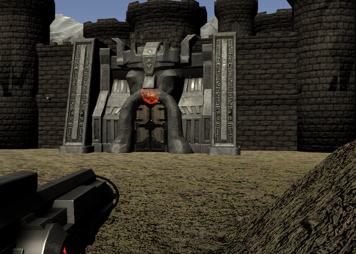

# Shooting with GA
shooting simulation with genetic algorithm

## Show case

## Description
This simulation tries to solve the better path to reach the target with gentic algorithm.

## GA
### Crossover
- One point crossover
Chromsome is an array of vectors. Since the sequence of those vectors is important for this case, I use one point crossover which normally does not destroy the sequence that much. 
### Selection
- Roulette selection
This selection is simply following the thoght of "The closer the distance to the target is, the higher the fitness is".
This is a simple algorithm, but powerful to inherit the better genom.
